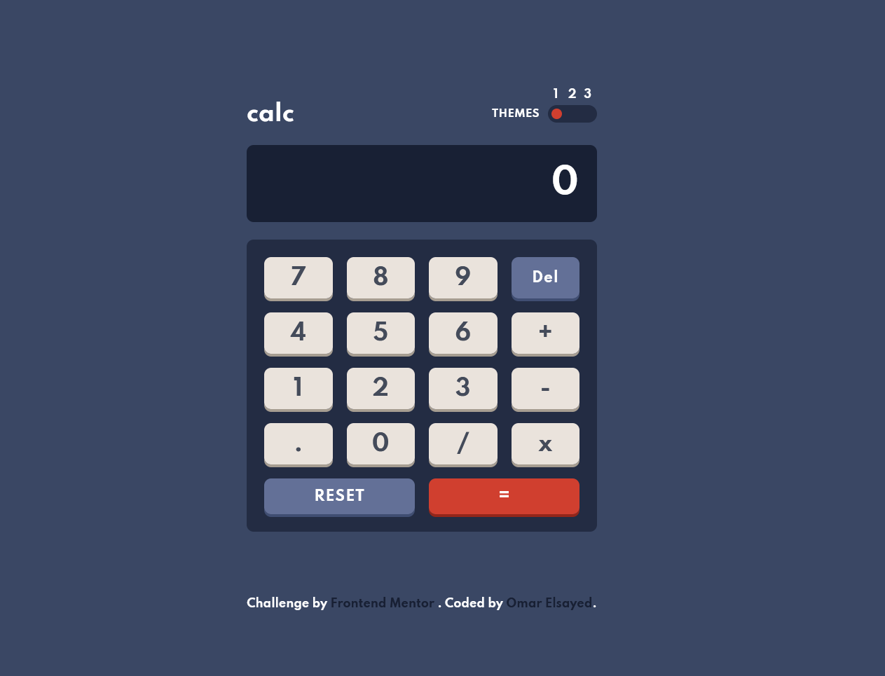
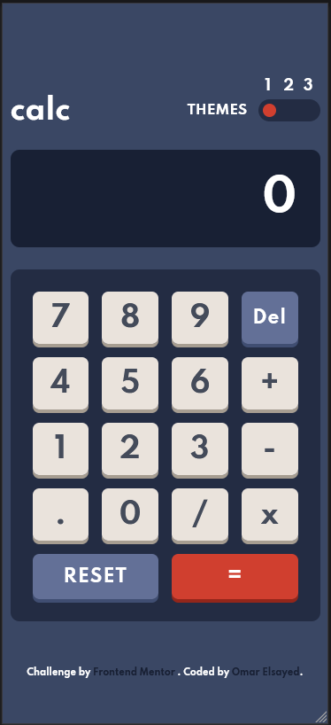

# Frontend Mentor - Calculator app solution

This is a solution to the [Calculator app challenge on Frontend Mentor](https://www.frontendmentor.io/challenges/calculator-app-9lteq5N29). Frontend Mentor challenges help you improve your coding skills by building realistic projects.

## Table of contents

- [Overview](#overview)
  - [The challenge](#the-challenge)
  - [Screenshot](#screenshot)
  - [Links](#links)
- [My process](#my-process)
  - [Built with](#built-with)
  - [What I learned](#what-i-learned)
  - [Continued development](#continued-development)
  - [Useful resources](#useful-resources)
- [Author](#author)
- [Acknowledgments](#acknowledgments)

## Overview

### The challenge

Users should be able to:

- See the size of the elements adjust based on their device's screen size
- Perform mathmatical operations like addition, subtraction, multiplication, and division
- Adjust the color theme based on their preference
- **Bonus**: Have their initial theme preference checked using `prefers-color-scheme` and have any additional changes saved in the browser

- ## Screenshot

  - Desktop
    
  - phone
    

- ### Links

  - Solution URL: [Here]()
  - Live Site URL: [Here]()

## My process

- ### Built with

  - Semantic Elements HTML5
  - CSS3 Grid
  - basic Javascript

- ### What I learned

  ```html
  <h1>Main Heading In HTML</h1>
  <p>Hello paragraph</p>
  ```

  ```css
  .grid {
    display: grid;
  }
  ```

  ```js
  const FunctionFunny = () => {
    console.log('🎉')
  }
  ```

- ### Continued development

  - I'm going to learn React Library and then Node.js so I could work as full-stack
  - Step two is to become a software engineer

- ### Useful resources
  - Arabic 2020
    - [HTML-Course](https://www.youtube.com/watch?v=6QAELgirvjs&list=PLDoPjvoNmBAw_t_XWUFbBX-c9MafPk9ji)
    - [CSS-Course](https://www.youtube.com/watch?v=X1ulCwyhCVM&list=PLDoPjvoNmBAzjsz06gkzlSrlev53MGIKe)
    - [JS-Course](https://www.youtube.com/watch?v=GM6dQBmc-Xg&list=PLDoPjvoNmBAx3kiplQR_oeDqLDBUDYwVv)

## Author

- LinkedIn - [@Omar](https://www.linkedin.com/feed/)
- Frontend Mentor - [@Omar](https://www.frontendmentor.io/home)
